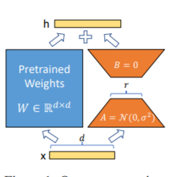
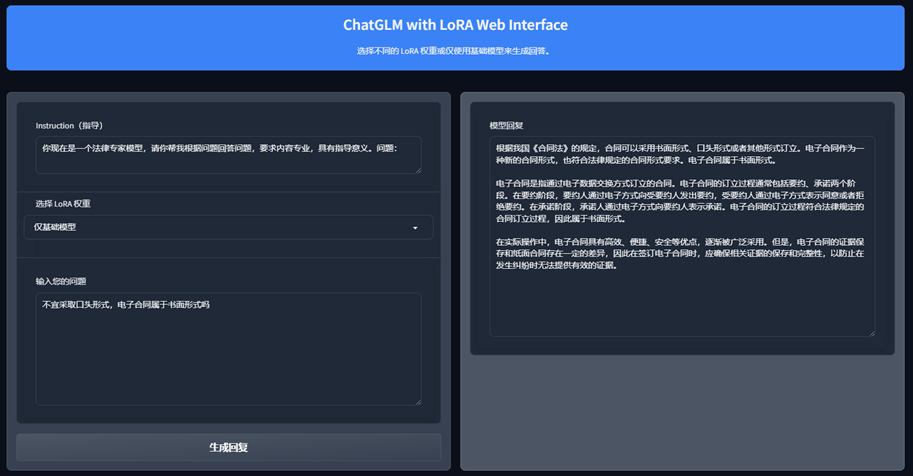
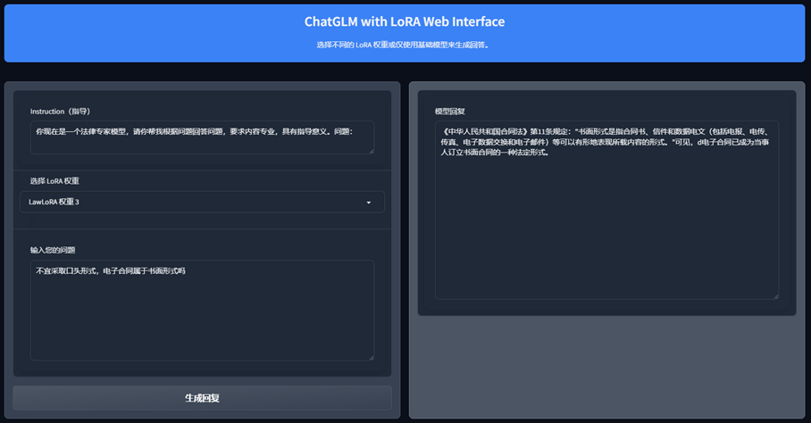

## LAWChatGLM微调
## 微调方法
模型微调时，如果遇到显存不够的情况，可以开启gradient_checkpointing、zero3、offload等参数来节省显存。

下面model_name_or_path参数为模型路径，请根据可根据自己实际模型保存地址进行修改。


### Lora方法
Lora方法，即在大型语言模型上对指定参数（权重矩阵）并行增加额外的低秩矩阵，并在模型训练过程中，仅训练额外增加的并行低秩矩阵的参数。
当“秩值”远小于原始参数维度时，新增的低秩矩阵参数量也就很小。在下游任务tuning时，仅须训练很小的参数，但能获取较好的表现结果。


- 论文：[paper](https://arxiv.org/abs/2106.09685)
- 官方代码：[Github](https://github.com/microsoft/LoRA)
- HuggingFace封装的peft库：[Github](https://github.com/huggingface/peft)
- 官方微调策略：[ChatGLM3/finetune_demo](https://github.com/THUDM/ChatGLM3/blob/main/finetune_demo/README.md)
- chatglm微调策略：[liucongg/ChatGLM-Finetuning: ](https://github.com/liucongg/ChatGLM-Finetuning)

lora方式微调的核心代码如下，主要包含训练参数的设定，模型的设定和调用
```python
model = MODE[args.mode]["model"].from_pretrained(args.model_name_or_path)
lora_module_name = args.lora_module_name.split(",")
config = LoraConfig(r=args.lora_dim,
					lora_alpha=args.lora_alpha,
					target_modules=lora_module_name,
					lora_dropout=args.lora_dropout,
					bias="none",
					task_type="CAUSAL_LM",
					inference_mode=False,
					)
model = get_peft_model(model, config)
model.config.torch_dtype = torch.float32
```
ChatGLM3单卡训练
```sh
CUDA_VISIBLE_DEVICES=0 deepspeed --master_port 2240 train.py \
                --train_path data/spo_0.json \
                --model_name_or_path ChatGLM3-6B/ \
                --per_device_train_batch_size 1 \
                --max_len 1560 \
                --max_src_len 1024 \
                --learning_rate 1e-4 \
                --weight_decay 0.1 \
                --num_train_epochs 2 \
                --gradient_accumulation_steps 4 \
                --warmup_ratio 0.1 \
                --mode glm3 \
                --lora_dim 16 \
                --lora_alpha 64 \
                --lora_dropout 0.1 \
                --lora_module_name "query_key_value,dense_h_to_4h,dense_4h_to_h,dense" \
                --seed 1234 \
                --ds_file ds_zero2_no_offload.json \
                --gradient_checkpointing \
                --show_loss_step 10 \
                --output_dir ./output-glm3
```
ChatGLM3四卡训练，通过CUDA_VISIBLE_DEVICES控制具体哪几块卡进行训练，如果不加该参数，表示使用运行机器上所有卡进行训练
```sh
CUDA_VISIBLE_DEVICES=0,1,2,3 deepspeed --master_port 2240 train.py \
                --train_path data/spo_0.json \
                --model_name_or_path ChatGLM3-6B/ \
                --per_device_train_batch_size 1 \
                --max_len 1560 \
                --max_src_len 1024 \
                --learning_rate 1e-4 \
                --weight_decay 0.1 \
                --num_train_epochs 2 \
                --gradient_accumulation_steps 4 \
                --warmup_ratio 0.1 \
                --mode glm3 \
                --lora_dim 16 \
                --lora_alpha 64 \
                --lora_dropout 0.1 \
                --lora_module_name "query_key_value,dense_h_to_4h,dense_4h_to_h,dense" \
                --seed 1234 \
                --ds_file ds_zero2_no_offload.json \
                --gradient_checkpointing \
                --show_loss_step 10 \
                --output_dir ./output-glm3
```
注意：Lora方法在模型保存时仅保存了Lora训练参数，因此在调用模型时要选择lora模块

```python
def load_model(lora_choice):
    if LORA_WEIGHTS_PATHS[lora_choice] is None:
        return base_model
    else:
        lora_model = PeftModel.from_pretrained(base_model, LORA_WEIGHTS_PATHS[lora_choice], torch_dtype=torch.float16).to("cuda")
        return lora_model
```

### 运行环境
查看requirements.txt文件

## 实验结果
- 为了防止大模型的数据泄露，采用一个百度法律问答数据集，并从中随机抽取50条作为测试集
- 训练示例：
```
{
    "instruction": "你现在是一个法律专家模型，请你帮我根据问题回答问题，要求内容专业，具有指导意义。问题：",
    "input": "合同纠纷仲裁流程要怎么走?",
    "output":您好，申请合同纠纷仲裁，首先您应向仲裁委员会提交仲裁申请书写明相关内容，仲裁委员会在收到您的仲裁申请书之日起五日内作出受理或者不予受理的决定，如果决定立案的，自作出决定之日起，五日之内会向您和对方发出相关的书面通知，同时将申请书副本送达对方，并要求其十五日内提交答辩书和证据。在仲裁开始前会先进行调解，调解无果即进行仲裁"
}
```

- 结果展示

  - 仅使用基础模型

  

  - 使用了lora微调后的模型

  

  注：以上法律问答知识来源于网络，仅作为大模型微调素材，不构成法律建议，具体问题请咨询法律从业人员


